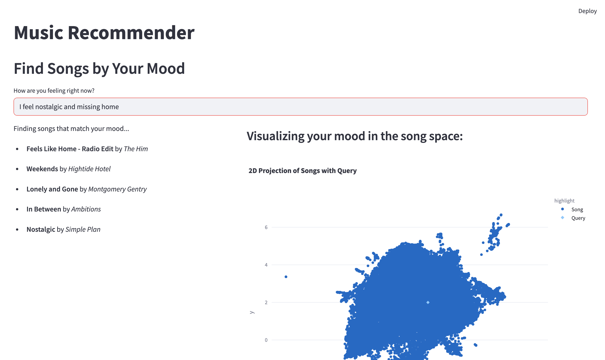
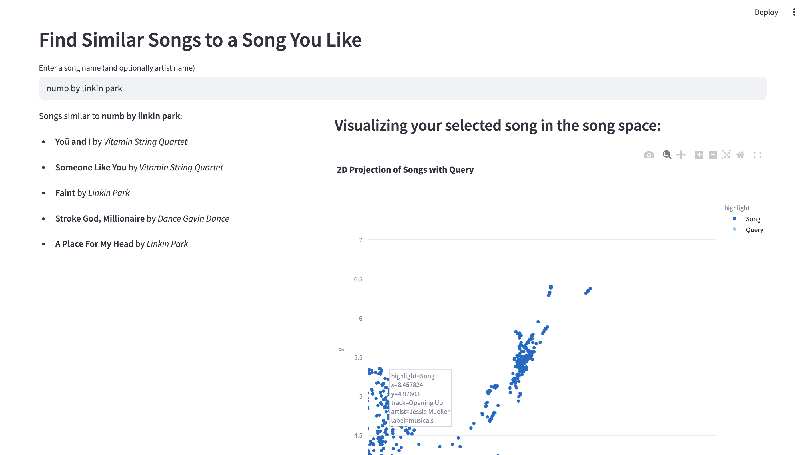

# LyrIQ: Semantic music recommendation based on spotify's million playlist dataset (MPD)

This project is a full-stack system that lets users:
- Get music recommendations based on their current mood or emotion (via natural language).
- Discover similar songs based on a chosen track.
- Visualize song embeddings in a 2D space using UMAP.

Lyric embeddings have been computed for 20k playlists out of the 1 million playlists owing to memory constraints.
It uses **lyric embeddings** as the core representation, leveraging Spotify and Genius APIs, approximate nearest neighbor search (via FAISS and Annoy), and a Streamlit-based frontend.

---



## Functionality Overview

### 1. Mood-to-Music Recommendation
- Users type how they're feeling (e.g., "calm and nostalgic").
- The app embeds that string and finds nearest neighbor songs based on lyric embeddings.
- Results are displayed and visualized.

### 2. Song-to-Song Recommendation
- Users type a song name (e.g., "Shape of You").
- The system retrieves the track ID using Spotify, fetches its lyric embedding, and returns similar songs using ANN search.

### 3. Visualization
- Songs and query embeddings are projected to 2D using UMAP.
- Users can view clusters and see where their mood or chosen song lies in the song space.



---

## Files and Modules

| File               | Purpose |
|--------------------|---------|
| `app.py`           | Main Streamlit interface |
| `helper.py`        | Utilities: embedding, querying, UMAP, Spotify/genius interfaces |
| `ann.py`           | Approximate nearest neighbor search with FAISS + Annoy |
| `globals.py`       | Authentication tokens and shared globals |
| `canon.py`         | Maps sub-genres to broad canonical genres |
| `completed.log`    | Tracks which playlist batches were processed |

---

## Required `.pkl` Files

The following pickle files are **required to run the app** and can be downloaded [here](https://huggingface.co/datasets/egupta/spotify-20k-semantic)

| Filename              | Description |
|------------------------|-------------|
| `embedding_genre.pkl` | List of `[lyric_embeddings, genre_labels, track_ids]` used to build ANN indices |
| `track_artist.pkl`    | Maps track IDs to artist and track names |
| `artist_genre.pkl`    | Maps artist URIs to genres, popularity, followers |
| `song_embeddings.pkl` | Contains per-track lyric embedding, brief embedding, raw lyric metadata |

These files are expected to be in the **same directory** as `app.py`.

---

## How to Run the App

1. Clone the repo
2. Install dependencies:
   ```bash
   pip install -r requirements.txt
   ```
3. Ensure all `.pkl` files are downloaded into the repo directory
4. Run:
   ```bash
   streamlit run app.py
   ```

---

## Dependencies

- `streamlit`
- `spotipy`
- `lyricsgenius`
- `sentence-transformers`
- `umap-learn`
- `plotly`
- `faiss` and `annoy`
- `scikit-learn`, `numpy`, `matplotlib`, `pandas`, `seaborn`

Use the following to install:

```bash
pip install -r requirements.txt
```

---

## Under the Hood

### Embedding Generation
- Lyrics are extracted from Genius.
- Embedded using `all-MiniLM-L6-v2` from `sentence-transformers`.

### ANN Index
- Built using both FAISS (L2) and Annoy (Euclidean).
- Queried for nearest lyrics given either user input or a known track.

### Genre Mapping
- Genres are fetched from Spotify and normalized to canonical classes (via `canon.py`).

### Visualization
- Embeddings projected with UMAP (`helper.plot_embeds_umap()` or `visualize_query_embedding_umap()`).
- Hovering reveals track name, artist, and genre.

---

## Example Use Case

**Input**: "I feel like dancing but I'm also a bit melancholic"  
**Output**:
- 5 similar songs based on lyrics
- A UMAP plot showing where your mood lands in the music space

**Input**: "Toxic by Britney Spears"  
**Output**:
- 5 songs with similar lyrical themes
- Visualization of this song in 2D lyric embedding space

---

## Credits

- Lyric data via [Genius](https://genius.com)
- Track metadata via [Spotify](https://spotify.com)
- Sentence embeddings from HuggingFace [MiniLM](https://huggingface.co/sentence-transformers/all-MiniLM-L6-v2)

---

## License

MIT

---

## TODO

- Add playlist-level recommendations
- Improve genre coverage for long-tail artists
- Add caching for Spotify/Genius calls
